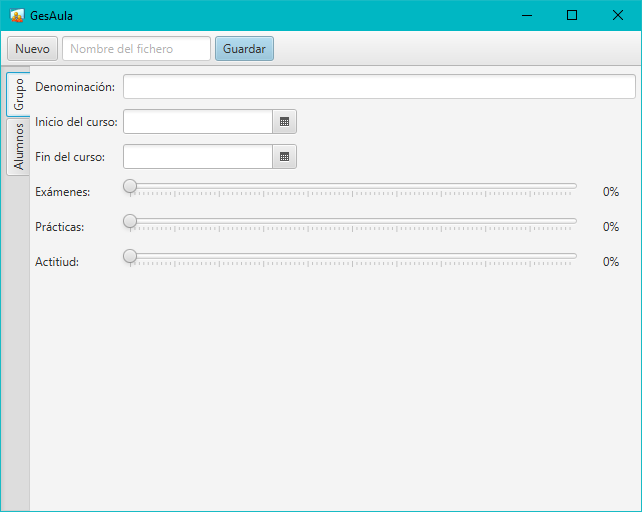
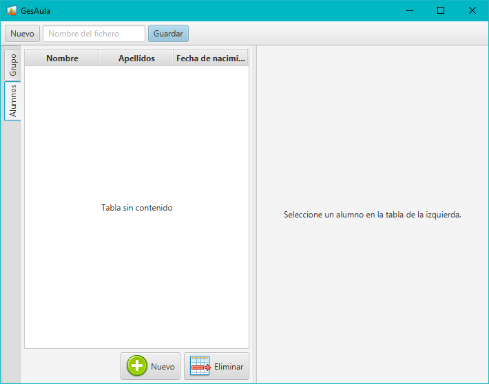
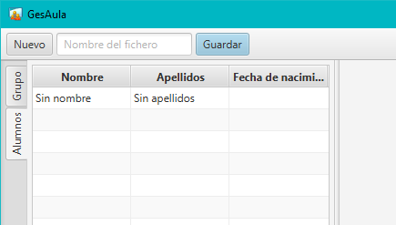
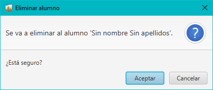
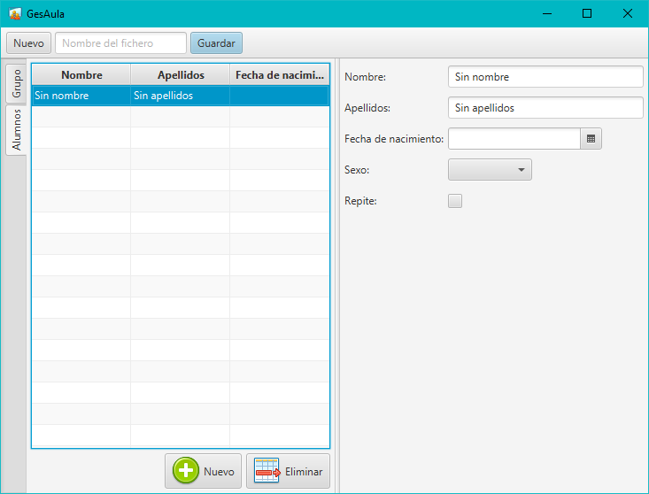
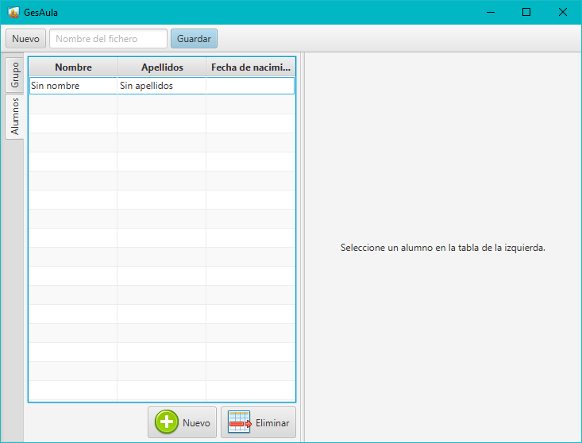

# GesAula

Implementar una aplicación en Java con interfaz gráfica de usuario para gestionar grupos de alumnos de un centro educativo.

Se deberá usar el framework JavaFX, aplicar el patrón de diseño MVC, así como implementar una interfaz que sea "responsive".

## Ventana principal

La ventana principal tendrá un **Toolbar** y un **TabPane** con dos pestañas.

### Pestaña "Grupo"

En la pestaña "Grupo" (primera pestaña) se gestionarán los datos del grupo, tal y como puede verse a continuación:



Para introducir los criterios de calificación se usará el componente "Slider". Por ejemplo:

```xml
<Slider fx:id="examenesSlider" majorTickUnit="10.0"
			minorTickCount="9" showTickMarks="true" snapToTicks="true" />
```

>   Este ejemplo corresponde al "Slider" de "Exámenes".

### Pestaña "Alumnos"

Los alumnos que forman parte del grupo se gestionarán desde la pestaña "Alumnos".



El botón "Nuevo" creará un nuevo alumno con datos por defecto, tal y como se muestra a continuación:



El botón "Eliminar" eliminará el alumno seleccionado. Se deberá pedir confirmación, y en caso de que no haya alumno seleccionado, se mostrará un mensaje de error.



Al seleccionar un alumno, se podrá editar su información en el panel derecho:



Cuando no haya alumnos seleccionados, deberá retirarse el panel de la derecha e informar al usuario de que no hay nada seleccionado:



### Barra de herramientas

En la "Toolbar" se podrá crear un grupo nuevo, lo que eliminará toda la información del grupo actual, limpiándose así por completo todos los datos de la interfaz.

```java
grupo = new Grupo();
```

El botón "Guardar" permitirá guardar el grupo en un fichero. El nombre del fichero se indicará en el cuadro de texto que hay a la izquierda del botón.

```java
grupo.save(new File(ruta));
```

